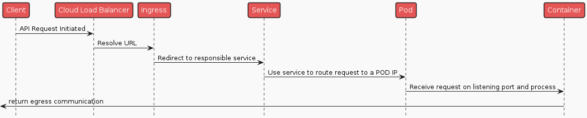
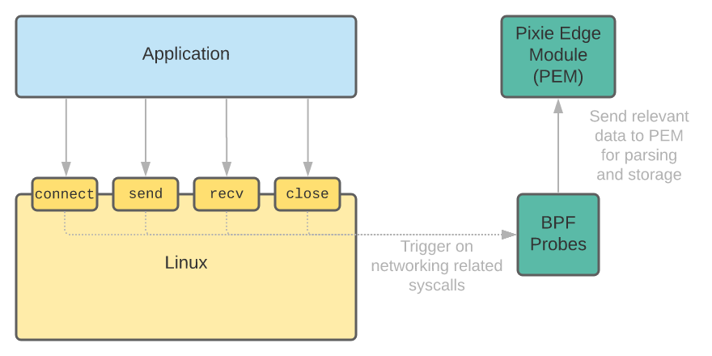
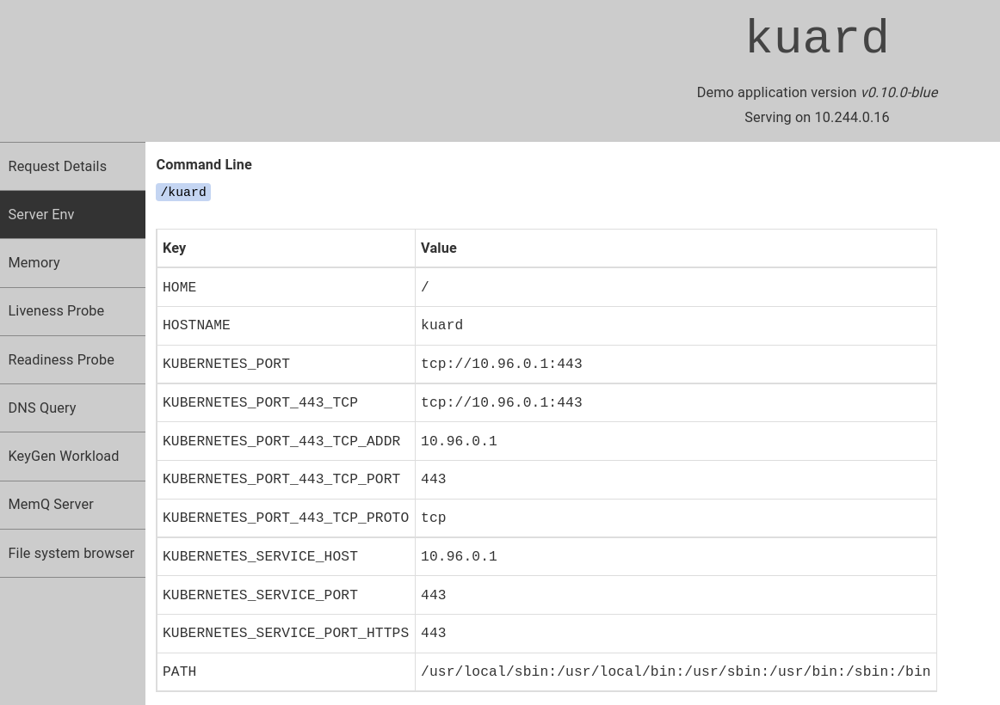
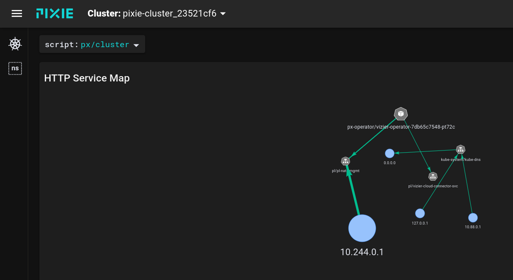
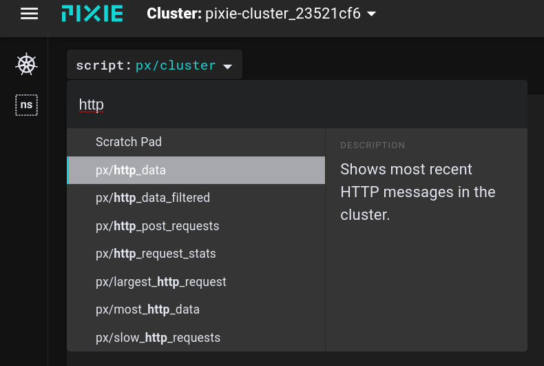
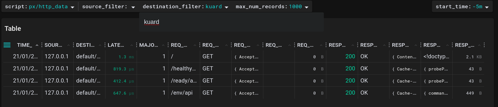
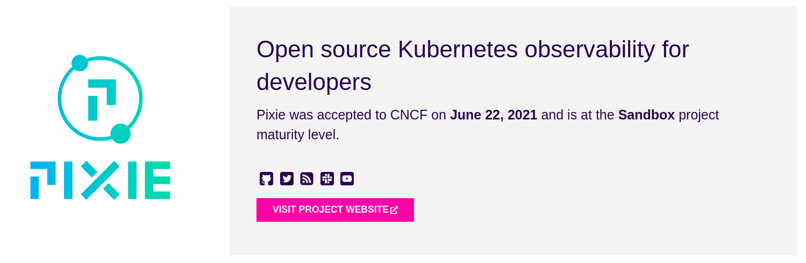

# How to tackle Kubernetes observability challenges with Pixie

Decentralized systems observability has always been challenging. Dealing with latency, distributed transactions, failures etc became increasingly complex.
The more abstraction a decentralized system has, the more difficult it is to reason about it, debug and troubleshoot.

## Challenges with debugging on K8s

The main reason that makes Kubernetes observability so difficult is the volatile and dynamic nature of workloads and resources. Instead of dealing with one server, we now deal with unknown number of servers (due to autos calling). Rather than having one monolithic application, we now have multiple distributed services. Same with databases, which often reside outside of the cluster.

Let's imagine making an HTTP(s) call to an API running on a Kubernetes cluster hosted on a cloud provider.
Here is a simplified sequence diagram showing critical points where



At any point of this communication chain things can go wrong, performance can degrade, security issues might occur, etc etc. Knowledge of what is happening on the cluster and detailed insights into each and every step of the communication chain is essential for operational performance.

### Where to observe

Now we know what to observe, but the question is how and where do we put our observability points, gateways of insight.

There are a couple of options:

- built the observability into service and code. This brings a high degree of control, but is cumbersome to maintain and not scalable.
- use sidecar pattern to inject observability logic into every pod. Better, but this can cause performance issues and is difficult to develop, as some different workloads need different metrics which can change over time
- use low level system calls to monitor usage of common protocols, stdout and stderr. This means installing something on the cluster itself, which is better, but often means giving this something extended privileges and Inge renting in Linux Kernel
- use low level system calls with eBPF probes. This brings high extensibility and low overhead.

Combine this with export more important metrics into Prometheus and you are good to go.

## How does it work?

Such a granular level of observability is possible thanks to eBPF (Extended Barkley Packet Filter). A protocol that makes the kernel programmable in a safe and performant way.

> eBPF is a revolutionary technology with origins in the Linux kernel that can run sandboxed programs in an operating system kernel. It is used to safely and efficiently extend the capabilities of the kernel without requiring to change kernel source code or load kernel modules. To learn more about eBPF, visit [Introduction to eBPF](https://ebpf.io/what-is-ebpf/)

<p style="text-align: center;"><small>Source: https://ebpf.io/what-is-ebpf/</small></p>

Here is a [great video](https://www.youtube.com/watch?v=5t7-HM2jlTM&ab_channel=ContainerSolutions) with Liz Rice explaining eBPF in detail.

Below diagram shows how eBPF works on a high level



<p style="text-align: center;"><small>Source: Pixie Webpage</small></p>

## Use Cases & Demo

Earlier we've seen a diagram with an example traffic flow in Kubernetes. Every step in this traffic should produce a valuable insights into our workloads.

Here is a list of typical insights both Dev and Ops will be interested in.

- how do the pods perform
- what is the latency between different calls
- what is the http payload
- how does the cluster behave under load

In the demo part we will be looking into HTTP traffic on a sample app.

Pixie CLI comes with predefined demo apps that we can install directly from the command line. However, those demos take long to load, instead we will use a different application.

## Prerequisites

To follow along with the demo, you will need to install following components:

- docker engine
- minikube cluster
- kubectl
- helm

## Installing Pixie

Pixie is an open source observability tool for Kubernetes applications. Pixie uses eBPF to automatically capture telemetry data without the need for manual instrumentation.

We will choose docker option for Pixie CLI to minimize system clutter.

```bash
alias px="docker run -i --rm -v ${HOME}/.pixie:/root/.pixie pixielabs/px"
```

## Installing Minikube

> Pixie currently only supports minikube, following install instructions are for Debian Linux
> Other installation instructions available at [Minikube Page](https://minikube.sigs.k8s.io/docs/start/#installation)

```bash
curl -LO https://storage.googleapis.com/minikube/releases/latest/minikube_latest_amd64.deb
sudo dpkg -i minikube_latest_amd64.deb
```

### Start minikube

This will start minikube with a KVM QUEMU driver.

```bash
minikube start --driver=kvm2 --cni=flannel --cpus=4 --memory=8000 -p=pixie-cluster
```

If you are running windows/MacOs use `--driver=hyperkit` option

### Create account with Pixie Cloud

It is possible to self host Pixie, but for the demo purposes we will create a free account to access metrics UI.

```bash
px auth login
```

### Obtain deploy-key

```bash
px deploy-key create
export PIXIE_DEPLOY_KEY=<copy key from the command result>
```

### Install Pixie on the cluster

```bash
helm install pixie pixie-operator/pixie-operator-chart --set deployKey=$PIXIE_DEPLOY_KEY --set clusterName=pixie-cluster --namespace pl --create-namespace
```

The installation might take a couple of minutes.

### Install Kuard

[Kuard](https://github.com/kubernetes-up-and-running/kuard) is a demo K8s application from the book "Kubernetes Up and Running"

```bash
kubectl run --restart=Never --image=gcr.io/kuar-demo/kuard-amd64:blue kuard
```

Once the pod is ready, forward port and access web UI

```bash
kubectl port-forward kuard 8080:8080
open http://localhost:8080/
```



## Explore Data

It is possible to run a query directly from a command line, but we are going to go right into a live UI.

Navigate to https://work.withpixie.ai/live/

From the `cluster` menu select your cluster



Click on the script drop down and select `http/data`.



In the destination filter type `kuard` to filter only the traffic to our pod.



Refresh the kuard page a few times and rerun the script using `RUN` button on the right hand side of Pixie UI.

Feel free to further explore Pixie UI and find metrics you are interested in.

## Architectural concerns

If you are considering Pixie for your workloads there might be architectural considerations that you want to address. Here are a few facts about how Pixie works that might help address some of them

- data stays on cluster, you can decide if you want to export anything for example to Prometheus metrics
- data is kept for 24h
- queries are extensible and can be written in PiXL language (derivative of Python)
- somewhere on the Roadmap is integration with [Open Telemetry](https://opentelemetry.io/) to enable seamless data export between well known tools like Prometheus or Jaeger.

## Learn more

Pixie is an sandbox CNCF project.



> To learn more about Pixie, check out their [web page](https://docs.px.dev/installing-pixie/) with more examples and in depth explanations as well as their [Github Repo](https://github.com/pixie-io/pixie).
